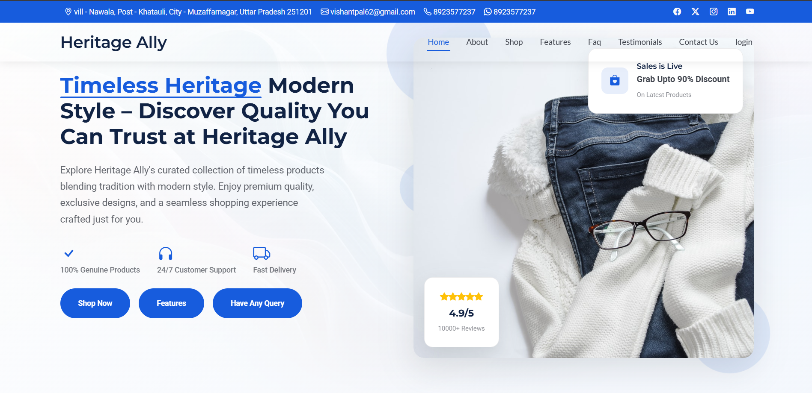
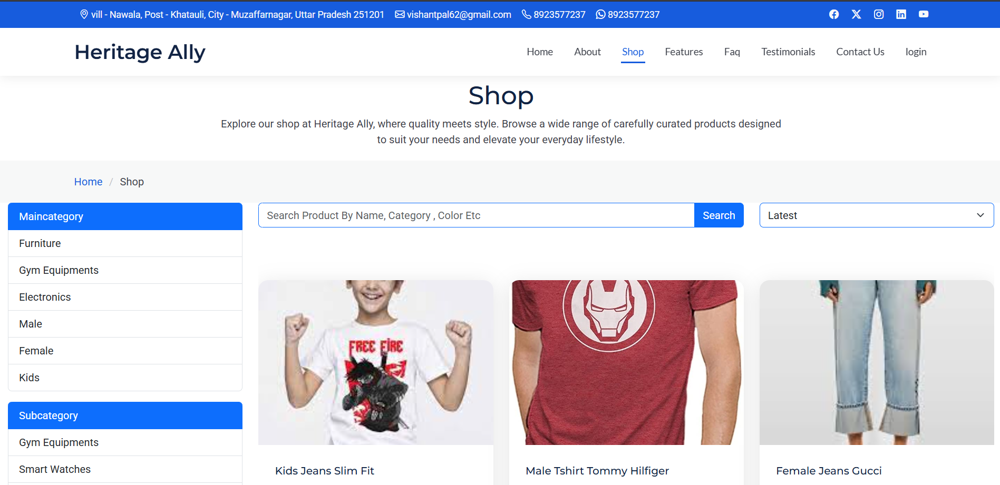
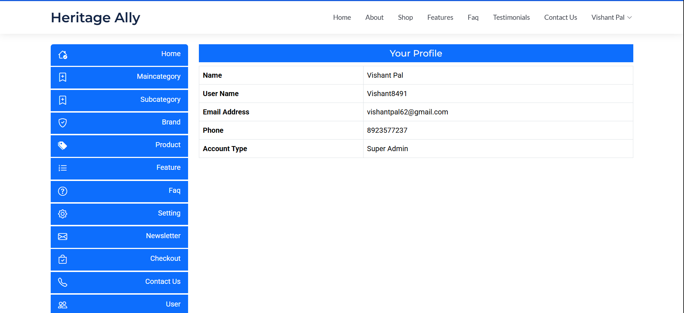
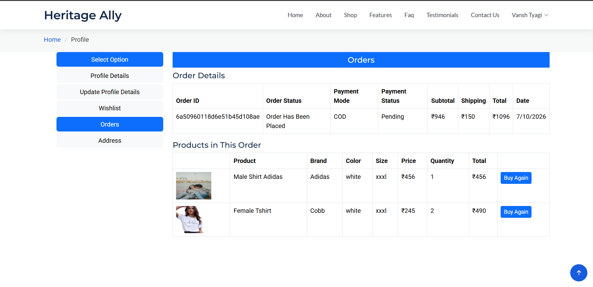

# 🛍️ HeritageAlly — E-Commerce Platform

> Timeless Heritage, Modern Style — Discover Quality You Can Trust at Heritage Ally


🔗 **Live Demo:** https://heritageally-gahe.onrender.com

---

## 📌 About The Project

HeritageAlly is a full-featured E-Commerce web application built with the **MERN Stack**. Users can browse and purchase **Clothes, Electronics, Furniture, Gym Equipment** and more — with a seamless, secure and responsive shopping experience.

---

## ✨ Features

### 👤 User Side
- ✅ Signup & Login with JWT Authentication
- ✅ OTP Verification & Forgot Password via Email
- ✅ Browse products by Main Category & Subcategory
- ✅ Search, Filter & Sort products
- ✅ Add to Cart & Wishlist
- ✅ Razorpay Payment Gateway (Net Banking, UPI, Cards)
- ✅ Order confirmation email after successful purchase
- ✅ Customer Reviews & Testimonials
- ✅ FAQ Section
- ✅ Contact Us form
- ✅ Fully Responsive UI across all devices

### 🛠️ Admin Side
- ✅ Complete Admin Dashboard with sidebar navigation
- ✅ Manage Main Categories & Subcategories
- ✅ Manage Brands, Products & Features
- ✅ View & manage all Orders
- ✅ User Management
- ✅ Newsletter Management
- ✅ Settings & Contact submissions

---

## 🧰 Tech Stack

| Layer | Technology |
|-------|-----------|
| Frontend | React.js, Tailwind CSS |
| Backend | Node.js, Express.js |
| Database | MongoDB Atlas |
| Authentication | JWT Tokens |
| Payment | Razorpay |
| Email | Nodemailer (SMTP) |
| Media Storage | Cloudinary |
| Deployment | Render |

---

## 📁 Project Structure

```
HeritageAlly/
│
├── frontend/         # React.js frontend
│   ├── src/
│   │   ├── components/
│   │   ├── pages/
│   │   ├── redux/
│   │   └── App.js
│   └── package.json
│
├── backend/          # Node.js + Express backend
│   ├── controllers/
│   ├── models/
│   ├── routes/
│   ├── middleware/
│   └── server.js
│
└── README.md
```

---

## ⚙️ Installation & Setup

### 1. Clone the repository
```bash
git clone https://github.com/vishant8491/HeritageAlly.git
cd HeritageAlly
```

### 2. Install Backend Dependencies
```bash
cd backend
npm install
```

### 3. Install Frontend Dependencies
```bash
cd ../frontend
npm install
```

### 4. Setup Environment Variables

Backend folder mein `.env` file banao:

```env
PORT=5000
MONGO_URI=your_mongodb_connection_string
JWT_SECRET=your_jwt_secret_key
RAZORPAY_KEY_ID=your_razorpay_key_id
RAZORPAY_KEY_SECRET=your_razorpay_key_secret
SMTP_EMAIL=your_email@gmail.com
SMTP_PASSWORD=your_email_app_password
CLOUDINARY_NAME=your_cloudinary_cloud_name
CLOUDINARY_API_KEY=your_cloudinary_api_key
CLOUDINARY_API_SECRET=your_cloudinary_api_secret
```

### 5. Run the Application

Backend:
```bash
cd backend
npm start
```

Frontend:
```bash
cd frontend
npm start
```

### 6. Open in Browser
```
http://localhost:3000
```

---

## 💳 Payment Integration

Razorpay integrated for secure checkout supporting:
- 🏦 Net Banking
- 📱 UPI
- 💳 Credit / Debit Cards

---

## 📧 Email System

| Trigger | Email Sent |
|---------|-----------|
| Successful Order | Order confirmation email |
| New Signup | OTP verification email |
| Forgot Password | Password reset link email |

All emails sent via **Nodemailer SMTP**

---

## 🔐 Security Features

- JWT token based authentication
- Protected routes for users & admins
- Password hashing with bcrypt
- OTP expiry validation
- Role-based access control (User / Admin / Super Admin)
- Environment variables for all sensitive keys

---

## 📸 Screenshots

### Homepage


### Shop Page


### Admin Dashboard


### Orders Panel


---

## 🚀 Deployment

Deployed on **Render** (free tier)

> ⚠️ Note: First load may take ~30 seconds as server wakes from sleep mode

---

## 👨‍💻 Author

**Vishant Pal**

- 📧 Email: vishantpal62@gmail.com
- 💼 LinkedIn: [linkedin.com/in/vishant-pal](https://www.linkedin.com/in/vishant-pal-42a9a9293/)
- 🐙 GitHub: [github.com/vishant8491](https://github.com/vishant8491)

---

## 📄 License

This project is built for **educational and portfolio purposes**.

---

⭐ **If you liked this project, please give it a star!** ⭐
